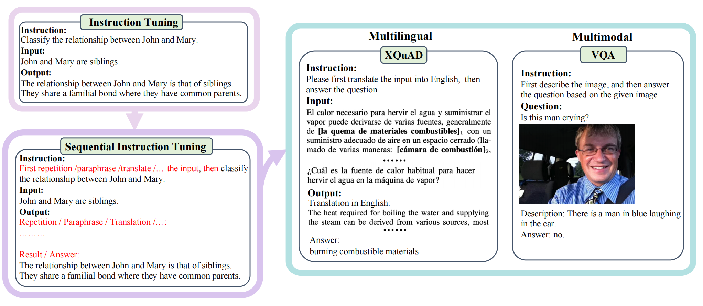

# Fine-tuning Large Language Models with Sequential Instructions

This is the code to replicate the instruction tuning experiments in the paper [*Fine-tuning Large Language Models with Sequential Instructions*]. [[cite]](#citation)

Our implementation is based on the [Alpaca-LoRA](https://github.com/tloen/alpaca-lora) and [LAVIS](https://github.com/salesforce/LAVIS/tree/main) repository.



## Setup

For text-only experiments 
```bash
conda create -n seq_ins python=3.8
conda activate seq_ins
pip install -r requirements.txt
```

For vision-language experiments
```bash
cd LAVIS
conda create -n seq_ins_vl python=3.8
conda activate seq_ins_vl
pip install -e .
```

Next, prepare train and eval data:
for text-only data:
```bash
cd construct_data
bash download_all_data.sh
```
for vision-langauge data:
```bash
cd LAVIS
bash download_vqa.sh
```

## Train
Train on text-only data, you can specify your preferred LLM, path of training dataset, training type (baseline or repeat) at `./train/ft_lora.sh`

Train on vision-langauge data, you can first specify the pre-trained checkpoint at `./LAVIS/lavis/configs/models/blip2`

then you can firstly specify the output models path at `./LAVIS/lavis/projects/instructblip/caption_coco_vicuna7b_train.yaml`, then 
```bash
bash run_scripts/blip2/train/eval_instruct_caption_coco.sh
```
## Eval
For text-only experiments, you can configure the path of lora adapters, the task name, training type, model name, and the path of output file in `./eval/infer_eval.sh`

## Citation
Please consider citing us if you use our materials.
```
@misc{hu2024finetuning,
      title={Fine-tuning Large Language Models with Sequential Instructions}, 
      author={Hanxu Hu and Pinzhen Chen and Edoardo M. Ponti},
      year={2024},
      eprint={2403.07794},
      archivePrefix={arXiv},
      primaryClass={cs.CL}
}
```


