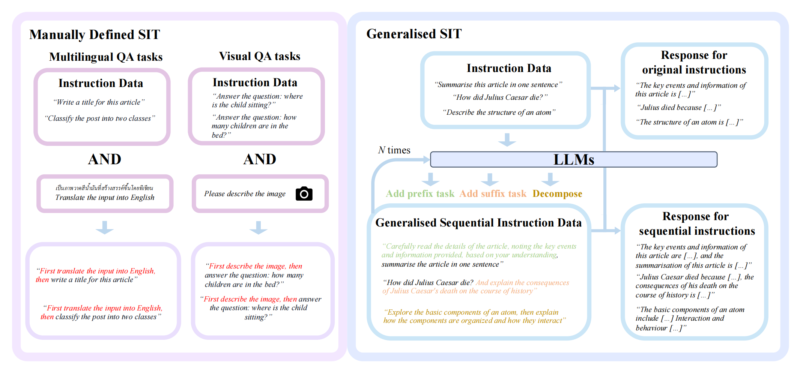

# *SIT*: Fine-tuning Large Language Models with Sequential Instructions


 [[Project Page](https://seqit.github.io/)] [[Data](https://huggingface.co/EdinburghNLP/SeqIns)] [[Model Zoo](https://huggingface.co/collections/HanxuHU/seqinst-models-667536ee1192e834e9ae02d2)]

This is the code to replicate the sequential instruction tuning experiments in the paper [*SIT*: Fine-tuning Large Language Models with Sequential Instructions](https://arxiv.org/pdf/2403.07794). [[cite]](#citation)

Our implementation is based on the [Open-Instruct](https://github.com/allenai/open-instruct) and [LAVIS](https://github.com/salesforce/LAVIS/tree/main) repository.



## Setup

For text-only experiments
```bash
#Prepare enviornment
conda create -n seq_ins python=3.8
conda activate seq_ins
bash setup.sh
```

For vision-language experiments
```bash
cd LAVIS
conda create -n seq_ins_vl python=3.8
conda activate seq_ins_vl
pip install -e .
```

Next, prepare train and eval data:
You can download sequential instruction data for training [here](https://huggingface.co/datasets/EdinburghNLP/SeqIns), then move it to `self-seq/data/`
And you can download evaluation data by running:
```bash
bash scripts/prepare_eval_data.sh
```
for vision-langauge data:
```bash
cd LAVIS
bash download_vqa.sh
```
## Generation SIT data
Convert original instruction tuning dataset to sequential version:

```bash
bash self-seq/scripts/generation_flancot_llama_70b.sh
```

## Train
To train both sequential instruction and original instruction data, you can specify your preferred LLM, path of training dataset at `scripts/alpaca/finetune_accelerate_sit_llama_70b.sh` and running:
```bash
bash scripts/alpaca/finetune_accelerate_sit_llama_70b.sh
```

Train on vision-langauge data, you can first specify the pre-trained checkpoint at `./LAVIS/lavis/configs/models/blip2`

then you can firstly specify the output models path at `./LAVIS/lavis/projects/instructblip/caption_coco_vicuna7b_train.yaml`, then 
```bash
bash run_scripts/blip2/train/eval_instruct_caption_coco.sh
```
## Eval
First, you should prepare evaluation datasets:

```bash
bash scripts/prepare_eval_data.sh
```

Then, you can run eval of all general and sequential tasks, please replace YOUR_MODEL_NAME as the path of your trained models

```bash
bash scripts/evaluation.sh YOUR_MODEL_NAME
```


## Citation
Please consider citing us if you use our materials.
```
@misc{hu2024sit,
      title={SIT: Fine-tuning Large Language Models with Sequential Instructions}, 
      author={Hanxu Hu and Simon Yu and Pinzhen Chen and Edoardo M. Ponti},
      year={2024},
      eprint={2403.07794},
      archivePrefix={arXiv},
}
```


